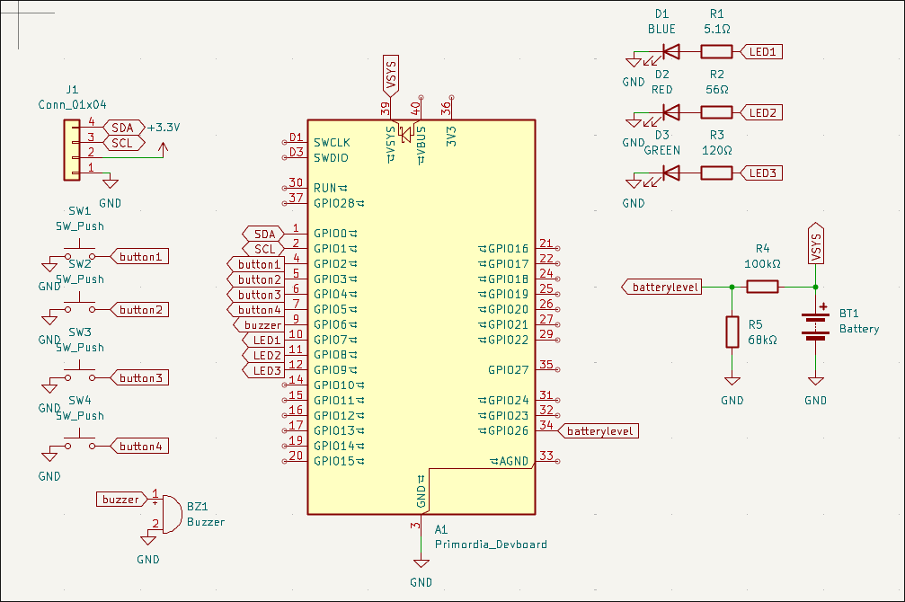
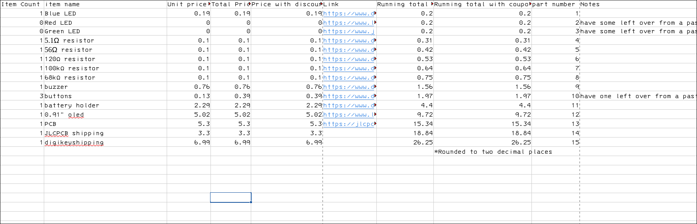

# May 18th, 2026: Start on schematic
start time 8:45
Made a custom symbol to match my custom Devboard so i can use that instead of a pico. i also have got all the other stuff i want to add added to the schematic. which is mostly the oled, a few buttons, a buzzer, and a few status LEDs. i also got a few of the items on the BOM.

**time spent: 3**

# May 18, 2026: Did PCB layout

sense this is a relatively simple project with the hard part mainly being the firmware the layout and routing wasn't very hard. i decided to go with 3xAAA batteries for power sense that is a good mix between longevity and weight. the name tag is held via two carabiners to a landyard sense it isnt two heavy.

** Time Spent: 2**
# May 19, 2026: optomized BOM and got started on firmware

i decided that now was a good time to get an estament on the cost of my pcb and shipping for everything and fond that it was over budget by a few bucks so i decided to see if getting all my parts from digikey would be cheaper which it was i am still a little over budget but i can cover the difrence just fine. i also got started on firmware. i am doing micropython for the firmware sense it it easy to adjust later and isn't more complicated then i need.

**timespent 0.5h