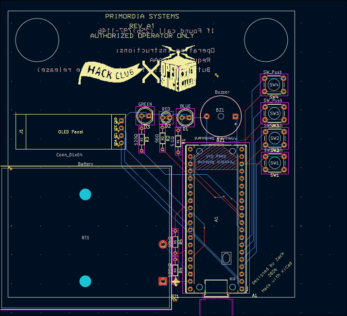

# Primortia nametag
i made this sense i wanted a way to have a name tag that had more personality then just a basic printed name tag. sense i have already designed a rp2040 devboard i decided to use that as the MCU. this has a pretty simple design so tobmake it your self you just need to get the pcb made then get all the other parts. sense one of the pins that is being used for the adc functionality in in a place that usually wouldn't have it printing my custom devboard is recommended unless you want to change the symbol to a regular pico.

BOM: